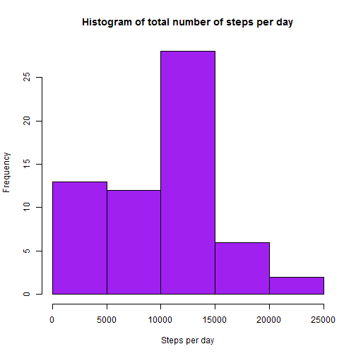
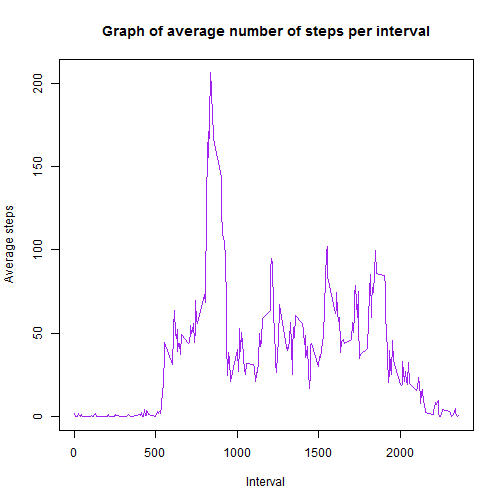
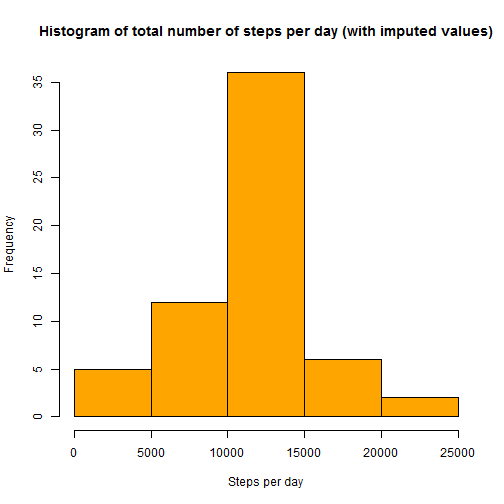
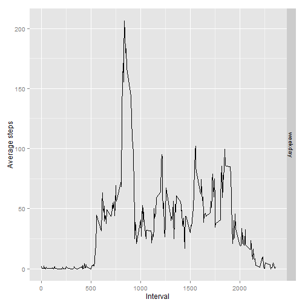

This is a report for the peer assessment #1 ot the reproducible research course on Coursera  

###Loading and formatting the data


```r
unzip("activity.zip")
data <-read.csv("activity.csv")
data$date <- as.Date(data$date)
Sys.setenv(LANG = "en")
```


### Total number of steps

A histogram of the total number of steps


```r
total_by_day <- aggregate(data$steps, list(data$date), sum, na.rm=T)
hist(total_by_day$x, main = "Histogram of total number of steps per day", col = "purple", xlab = "Steps per day")
```

 
Median of steps per day

```r
med_orig <- median(total_by_day$x, na.rm=T)
med_orig
```

```
## [1] 10395
```
Mean of steps per day

```r
mean_orig <- mean(total_by_day$x, na.rm=T)
mean_orig
```

```
## [1] 9354.23
```
###What is the average daily activity pattern
A graph of the average number of steps  

```r
average_by_interval <- aggregate(data$steps, list(data$interval), mean, na.rm=T)
plot(average_by_interval$Group.1, average_by_interval$x, main = "Graph of average number of steps per interval", type = "l", col = "purple", xlab = "Interval",
     ylab = "Average steps"
     )
```

 

The inteval with the largest number of steps  


```r
mx_idx <- which.max(average_by_interval$x)
average_by_interval$Group.1[mx_idx]
```

```
## [1] 835
```

###Imputing missing values  
The number of missing values  

```r
sum(is.na(data$steps))
```

```
## [1] 2304
```

Creating a new table without missing values. The strategy to do it: reprace the missing value with the averate steps for the iterval of this row

```r
data_mod <- data
for (i in 1:length(data_mod$steps)){
    if (is.na(data_mod$steps[i])){
        interval <- data_mod$interval[i]
        tem <- average_by_interval[average_by_interval$Group.1 == interval,]
        data_mod$steps[i] <- tem$x[1] 
    }
    
}
```

Histogram of total steps by day on a modified data

```r
total_by_day_mod <- aggregate(data_mod$steps, list(data_mod$date), sum, na.rm=T)
hist(total_by_day_mod$x, main = "Histogram of total number of steps per day (with imputed values)", col = "orange", xlab = "Steps per day")
```

 

Median of steps per day

```r
med_mod <- median(total_by_day_mod$x, na.rm=T)
med_mod
```

```
## [1] 10766.19
```

Mean of steps per day

```r
mean_mod <- mean(total_by_day_mod$x, na.rm=T)
mean_mod
```

```
## [1] 10766.19
```

Difference between the original median and that computed on a set with inputed values

```r
med_orig - med_mod
```

```
## [1] -371.1887
```


Difference between the original mean and that computed on a set with inputed values

```r
mean_orig - mean_mod
```

```
## [1] -1411.959
```

###Differences in activity patterns between weekdays and weekends

Graphs for average number of steps for weekends and weekdays


```r
#add a coun with weekdays
library(plyr)
wk <- weekdays(data_mod$date)
for (i in 1:length(wk)){
   if (wk[i] == "суббота"){wk[i] <- "weekend"}
   else if (wk[i]=="воскресенье"){wk[i] <- "weekend"}
   else{wk[i] <- "weekday"}
}
data_mod <- mutate(data_mod, weekdays = wk)
aggr_wd <- aggregate(data_mod$steps, list(data_mod$interval, data_mod$weekday), mean)

library(ggplot2)
```

```
## Warning: package 'ggplot2' was built under R version 3.1.3
```

```r
qplot(Group.1, x, data = aggr_wd, facets = Group.2~., geom = "line", ylab = "Average steps", xlab = "Interval")
```

 
